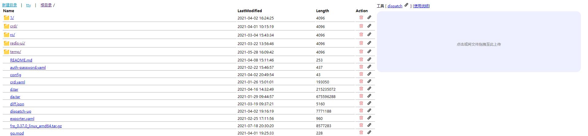
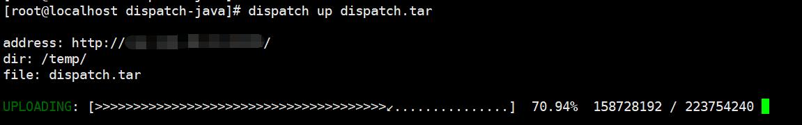

## dispatch

简单的云盘小程序

> 文件上传、下载时不会将文件整个地读入内存，以减少内存占用  
> 基于：[netty-RESTful](https://github.com/zhizuqiu/netty-RESTful)

### Server

支持上传、下载、认证、Terminal、Markdown Render、[弹幕](https://github.com/zhizuqiu/danmu-comment)



### [Client](https://github.com/zhizuqiu/dispatch-tools):

支持上传、列举文件、认证



### run

[docker hub](https://hub.docker.com/r/zhizuqiu/dispatch)

```
docker run -d -p 39001:80 -p 39004:39004 \
-v [your-path]:/resources/data \
--restart=always \
-e DP_GOTTY_PORT=39004 \
-e DP_ENABLE_LOGIN=true \
-e DP_USER=admin \
-e DP_PASSWORD=12345 \
docker.io/zhizuqiu/dispatch:java-latest
```

访问：`http://[your-ip]:39001/`

其他的环境变量：
- DP_PORT 端口
- DP_ENABLE_MARKDOWN_TO_HTML 是否开启 markdown 渲染 
- DP_DANMUHOST、DP_DANMUPORT 指定 [danmu-comment](https://github.com/zhizuqiu/danmu-comment) 的 server 地址