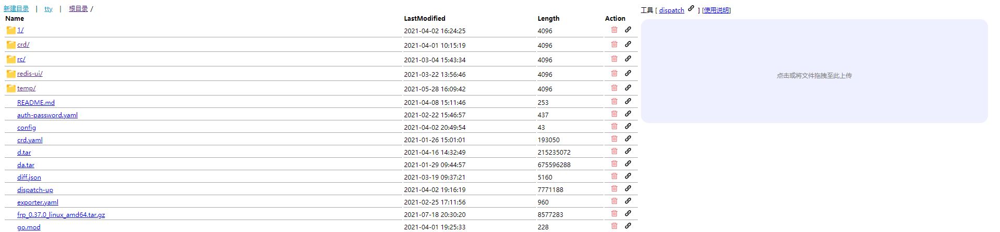

## dispatch

简单的云盘小程序



## run

[docker hub](https://hub.docker.com/r/zhizuqiu/dispatch)

```
docker run -d -p 39001:80 -p 39004:39004 \
-v /home/root/data/dispatch:/resources/data \
-e DP_GOTTY_PORT=39004 --restart=always \
docker.io/zhizuqiu/dispatch:java-latest
```

其他的环境变量：
- DP_PORT 端口
- DP_ENABLE_MARKDOWN_TO_HTML 是否开启 markdown 渲染 
- DP_DANMUHOST、DP_DANMUPORT 指定 [](https://github.com/zhizuqiu/danmu-comment) 的 server 地址